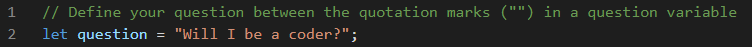
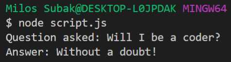

# Mixed Messages
> Project builds up a program that outputs a new, random message every time a user runs the program. Message is an answer to the user's boolean question. Program acts like a [Magic 8-Ball](https://en.wikipedia.org/wiki/Magic_8-Ball). It will predict your future!

## Table of contents

  - [General info](#general-info)
  - [Setup](#setup)
  - [Code Examples](#code-examples)
  - [Inspiration](#inspiration)
  - [Contact](#contact)

## General info
Project builds up a message generator program. My objectives are following:
- put together knowledge I gained from studying coding
  - JavaScript, Git, GitHub, Command Line, VS Code 
- predict the future! :8ball::question::innocent:

## Setup
Running the program can be a bit complicating for a non-programmer users as it is written purely in JavaScript file. Therefore, there will be 2.0 version built in some more interactive way for the wider audience that will be released soon (hopefully :blush:)! But in case you are familiar with command line and NODE, you can run the script.js file and enjoy some awesome predictions!

## Code Examples
**Step 1** Define your question in script.js (line 2).

**Step 2** Run the code in command line and see your result.

## Inspiration
Based on CodeCademy.com project in Full-Stack Engineer learning path.

## Contact
Created by [@subakmil](https://github.com/subakmil) - feel free to contact me!
